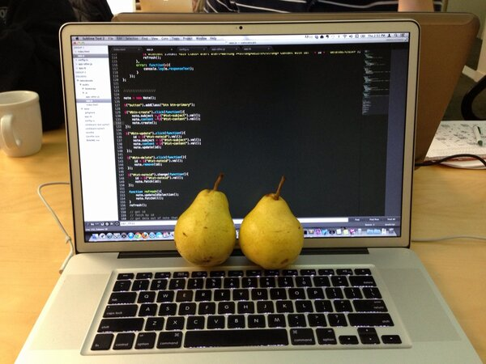

<figure>
	
</figure>

That's pear programming. Pair programming is when two programmers share a computer to work on code together. It's becoming more popular for a number of reasons. It's a great way to create more maintainable code, share knowledge, and develop good habits from each other. However, it is new. Relatively few companies used pair programming until recently. It's not uncommon to meet a 12 year veteran programmer who has never pair programmed. That's changing though, and more companies are embracing pair programming.
<figure>
	
</figure>

###Higher Bus Count
Perhaps one of the more grim reasons for pair coding is sharing overall knowledge of the codebase. For example, if a member of your project team was hit by a bus, would you be able to step in and work on their code? Did they have a unique knowledge of the code that made that person invaluable to the team? As students at Flatiron this is less of a concern for us but in the job field working with a real codebase, this is a concern.

###Higher Quality Code
Pair programming produces higher quality code. With two programmers looking over the same monitor and the same code, they can bounce ideas off each other and find the best solution to complex problems. As programmers we each have our own strengths and weaknesses based on our interests and backgrounds. A second set of eyes helps find typos or syntax errors in the code, that would otherwise halt the development cycle. 
<figure>
	
</figure>

###Maintainable Code
Another advantage to working on code two by two is creating more maintainable code. By working in pairs programmers are forced to explain their approach to the problem to each other and agree on a common approach. If one programmers approach is incomprehensible to the other, it's likely nonmaintainable code and a different approach will have to be used. 

##Pair Programming Etiquette
I did quite a bit of seaching to find rules that people can agree to when it comes to pair programming. This section comes with a big disclaimer. The rules I outline are the most commonly used ones. However, there's a lot more that goes into pair programming than what's outlined here. Read these over and discuss them with your would-be pair programmer. You might find additional rules that work for you and you may find that some of these rules are not applicable to you.

<figure>
	
</figure>

###Rules

- **Listen to your partner.** Make sure you're not brushing off your partners ideas. An idea might seem crazy initially, but hear them out. They're probably going somewhere with it.
- **Share your knowledge and expertise.** We're all learning and we all bring different skill sets to the table. Share any tips and tricks you've come across with your partner as they become relevant.
- **Don't hog the keyboard.** Even though one of you is driving, both of you should feel comfortable offering direction. Talk through your solution and listen to each other. No one likes it when the person on the keyboard blasts ahead and ignores their partner.
- Most imprtantly **be nice**. Not everyone likes pair programming, or their partner, but that's no excuse for treating them poorly. Use what separates you from your partner as a strength not a weakness. 

As I said before, these rules are just a starting point for a successful pair programming duo. Try to anticipate any other issues that may arrise and think about how you can solve them preemptively. 

